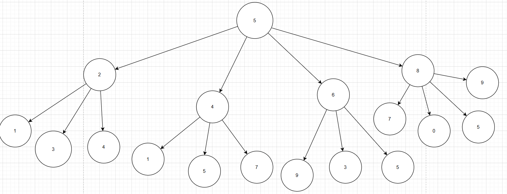

# Examen parcial No.2

## Problema 1

Dado un número positivo n y un teclado móvil de un Nokia 3230, que tiene dígitos del 0 al 9  
asociados con cada tecla, se desea contar el total de combinaciones posibles de dígitos  de longitud n.  
Podemos comenzar con cualquier dígitos  y presionar solo cuatro teclas adyacentes a cualquier dígitos .  
El teclado también contiene las teclas  ∗  y #, las cuales no están permitidas presionar.

### Explicar porque este problema exhibe subestructura óptima

El objetivo del problema es 

### Explique una idea/solución que exhiba subproblemas traslapados e indique cómo los mismos subproblemas se computan repetidamente.

### Escriba un código en Python con enfoque de memoización top-down que resuelva este problema

[Repositorio](https://github.com/PedroPabloGuzmanMayen/Parcial2_ADA.git)

### Encuentre el tiempo de complejidad para este algoritmo.

Para hallar la complejidad de este algoritmo, primero definiremos una ecuación de recurrencia. Sabemos que la solución para un dígito en específico esta dada por las soluciones de sus dígitos adyacentes en el teclado . También sabemos que debemos hallar la solución para cada uno de los dígitos del teclado (0-9). 

Por esa razón, primero definiremos una función para hallar una ecuación de recurrencia para hallar el total de combinaciones para un dígito en específico.

Sea A(e) el conjunto de números adyacentes para un dígito e y sea d un dígito entre 0 y 9 y n un número $\in N$ , tenemos: 

$$
F(d, n) =
\begin{cases}
1, & \text{si } n = 0  \\\\
\sum F(a, n-1) para toda a $\in Adj(d)$, & \text{si } n > 0 \\\\
\end{cases}
$$

### Usando su programa, encuentre las combinaciones totales posibles para  n  = 10.

## Problema 2

Dada una matriz cuadrada de 0’s y 1’s, calcule el tamaño de la cruz (símbolo de suma +) más grande  
formada por 1’s

## Problema 3

## Problema 5

